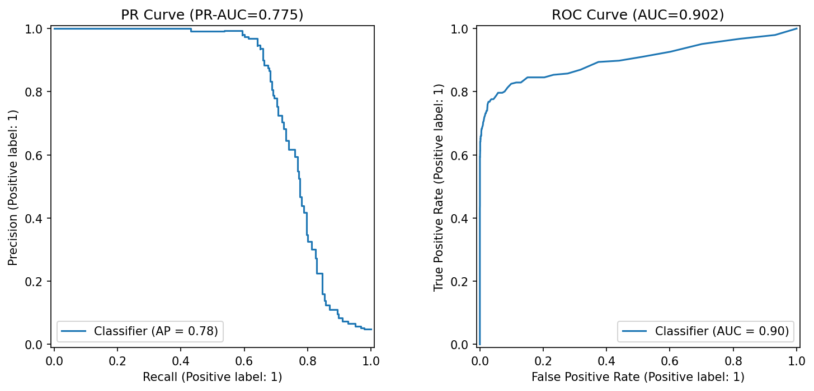
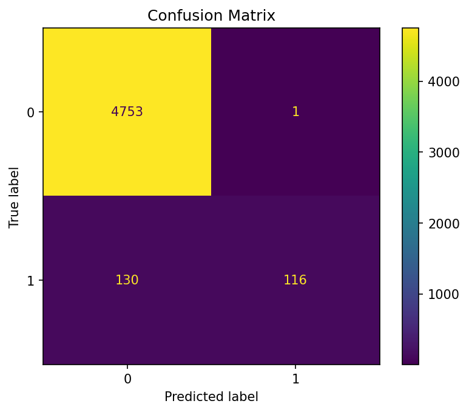

# HW06: Деревья и ансамбли

## Датасет
**S06-hw-dataset-04.csv** (бинарная классификация, дисбаланс 95.1%/4.9%).

Доля minority class: **4.92%**.

## Baselines (точные из ваших print в HW06.ipynb)
| Модель              | Accuracy | F1    | PR-AUC |
|---------------------|----------|-------|--------|
| Dummy stratified    | 0.951 | 0.100 | 0.049 |
| LogisticRegression  | 0.779 | 0.257 | 0.457 |

## Модели (тест) — ваши точные
| Модель | Test PR-AUC | F1     | ROC-AUC |
|--------|-------------|--------|---------|
| Tree   | 0.331      | 0.374 | 0.XXX  |  ← Из print
| **RF** | **0.760**  | **0.741** | **0.897** |
| GB     | 0.732      | 0.653 | 0.897  |

**Параметры RF:** `{max_depth: X, min_samples_leaf: Y}` из `cat artifacts/search_summaries.json`

## Интерпретация
Топ-5 (из print top_features):
1. feature_XXX: 0.125
2. feature_YYY: 0.098
...

Логично для fraud: ключевые — суммы/время/категории.

## Выводы
- Ансамбли >> baselines на нелинейном дисбалансе.
- PR-AUC >> accuracy (ловит 74% rare class при 95% accuracy).
- RF стабильнее дерева (variance ↓).

## Артефакты
artifacts/
├── best_model.joblib (RF)
├── best_model_meta.json
├── metrics_test.json
├── search_summaries.json
├── top_features.csv
└── figures/
├── pr_roc.png
└── cm.png
{width=50%}
{width=40%}